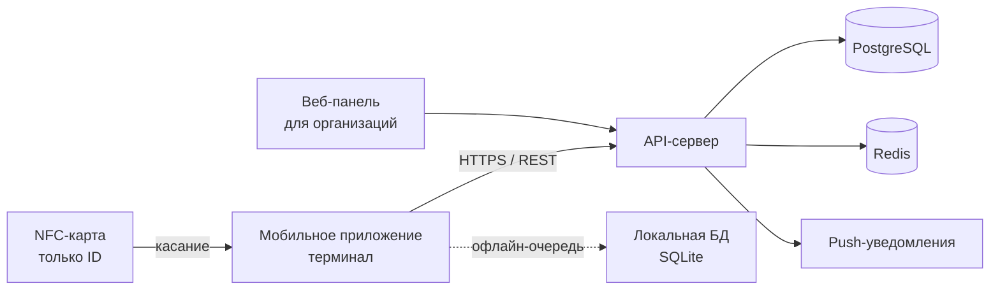
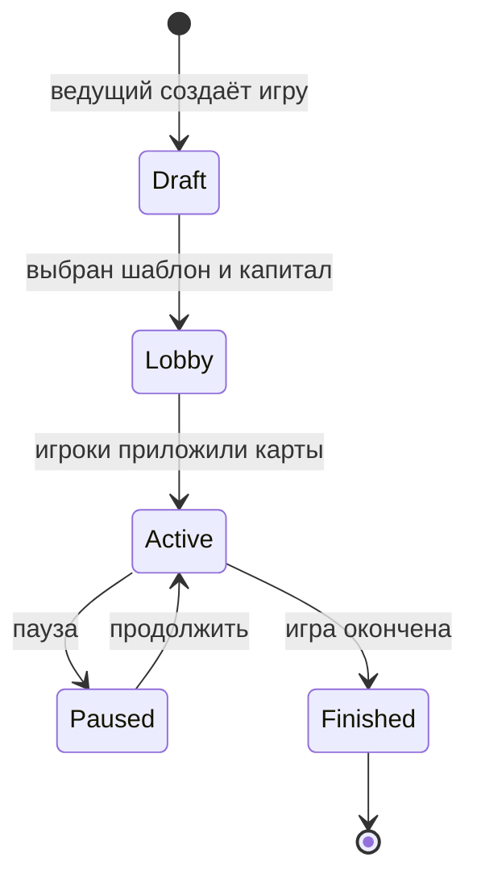
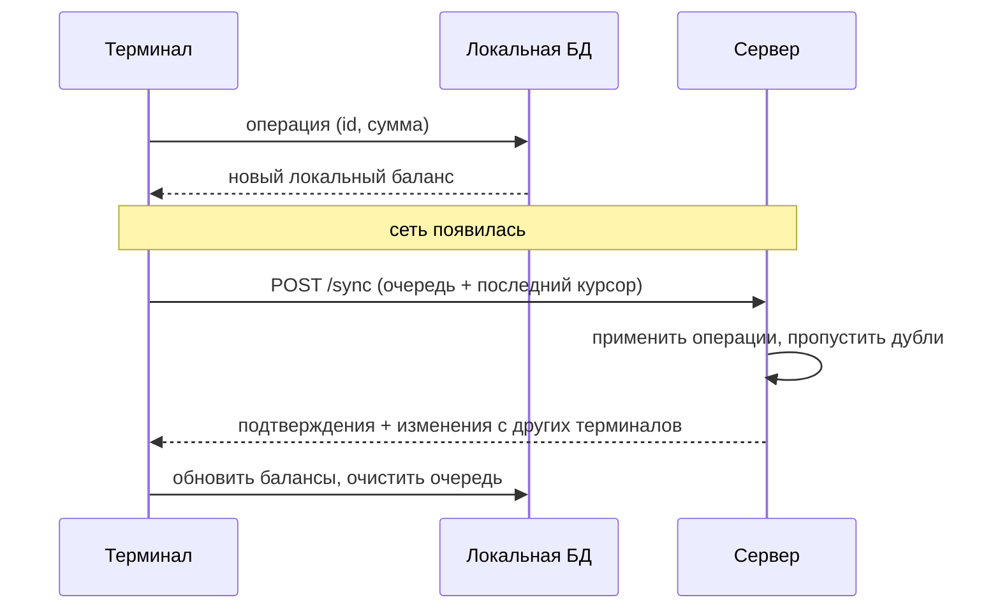

# Детский банк на NFC-картах — архитектура

Sep 24, 2026 · @Fred Wu

## Обзор и требования

Система — это игровой «банк» для детей: NFC-карта служит идентификатором игрока, телефон ведущего работает как терминал, а все балансы хранятся на сервере. Виртуальные деньги никогда не покупаются и не выводятся за реальные деньги — это ключевое продуктовое и юридическое ограничение.

### Роли

| Роль | Кто это | Что может |
| --- | --- | --- |
| Владелец аккаунта | Родитель или администратор организации | Регистрирует аккаунт, создаёт профили детей, привязывает карты, управляет группами |
| Ведущий (терминал) | Родитель, вожатый, учитель, старший ребёнок | Запускает игры, списывает и начисляет деньги, принимает оплату картой |
| Игрок | Ребёнок с картой | Платит картой; в детском режиме приложения видит свой баланс и историю, делает переводы в рамках лимитов |
| Организация | Лагерь, школа, кружок | Несколько ведущих, сотни игроков, «магазин», начисления по расписанию |

### Ключевые сценарии

1. **Игровая сессия.** Ведущий создаёт игру, участники прикладывают карты, у всех обнуляется игровой баланс и начисляется стартовый капитал. После окончания игры сессия закрывается и остаётся в истории.
2. **Постоянный счёт.** У каждой карты есть долгосрочный баланс: семейные «зарплаты» за дела, валюта лагеря, накопления на призы.
3. **Терминал.** Ведущий вводит сумму, игрок прикладывает карту — деньги списываются. Возможны начисление, перевод между игроками и проверка баланса.
4. **Магазин (для организаций).** Каталог товаров с ценами, покупка в одно касание.

### Режимы приложения

Одно приложение работает в двух режимах, режим выбирается при создании или запуске игры.

- **Банк.** Телефон ведущего становится терминалом: списания, начисления, магазин, управление игрой. Выход из режима — по PIN-коду.
- **Игрок.** Детский режим на телефоне ребёнка: свой баланс, история операций, переводы другим игрокам, итоги игры. Ребёнок не регистрируется сам: родитель привязывает его телефон к профилю через QR-код.

В детском режиме приложение показывает последний известный баланс и без сети; операции проводит только «Банк».

### Нефункциональные требования

- Операция на терминале занимает не больше 1–2 секунд от прикосновения картой до результата.
- Игра продолжается без интернета, данные синхронизируются позже.
- Один аккаунт организации выдерживает 500+ игроков и 20+ одновременных терминалов.
- Минимум персональных данных детей: имя или прозвище, без фото, телефона и почты.

## Компоненты системы

Система состоит из одного мобильного приложения (Android + iOS), сервера с API и базой данных и простой веб-панели для организаций. Сервер — единственный источник правды о балансах; телефон хранит только локальную копию для офлайн-работы.



Карта передаёт телефону только свой идентификатор; всё остальное решает сервер.

| Компонент | Назначение |
| --- | --- |
| Мобильное приложение | Вход родителя или ведущего, профили детей, привязка карт, режим терминала, история, офлайн-очередь операций |
| API-сервер | Аутентификация, учёт счетов и операций, игровые сессии, синхронизация, права доступа |
| PostgreSQL | Аккаунты, игроки, карты, счета, журнал операций |
| Redis | Сессии авторизации, ограничение частоты запросов, блокировки при конкурентных списаниях |
| Веб-панель | Для лагерей и школ: массовая привязка карт, ведущие, магазин, отчёты, выгрузка в Excel |
| Push-уведомления | Родителю: «ребёнку начислено 50 монет»; ведущему: «синхронизация завершена» |

## NFC-карты

На карте хранится только идентификатор, деньги — на сервере и привязаны к игроку, а не к карте. Поэтому потерянную карту можно заблокировать и заменить без потери баланса.

### Выбор метки

| Вариант | Защита от копирования | Цена в партии (примерно) | Когда брать |
| --- | --- | --- | --- |
| NTAG213 / NTAG215 | Нет: UID и данные копируются | 0,1–0,3 $ за метку | Прототип, семейные наборы |
| NTAG424 DNA | Да: каждое касание даёт новую подпись AES (SUN) | 0,5–1 $ за метку | Лагеря и школы, где дети могут подделывать карты |

Цены ориентировочные, их нужно уточнить у производителей карт. Обе метки читаются и на Android, и на iPhone (iPhone 7 и новее через Core NFC).

### Что записано на карте

- **UID** — заводской номер чипа, 7 байт.
- **NDEF-ссылка** вида `https://<домен>/c/<token>`. Если приложить карту к любому телефону, откроется приложение или страница «Эта карта принадлежит игре…». Это ещё и бесплатный маркетинг.
- После записи метка блокируется от перезаписи.

### Жизненный цикл карты

1. **Производство.** Каждой карте присваивается `token`, UID и код активации (печатается на упаковке). Карта заносится в базу в статусе «на складе».
2. **Активация.** Родитель в приложении нажимает «Добавить карту» и прикладывает её. Сервер проверяет, что карта существует и свободна, и привязывает её к профилю ребёнка.
3. **Использование.** При каждом касании терминал отправляет `token` (и подпись SUN для NTAG424), сервер находит игрока.
4. **Потеря.** Родитель блокирует карту в приложении и привязывает новую. Баланс остаётся у игрока.
5. **Передача.** Карту можно отвязать и отдать другому ребёнку, история прежнего владельца не переходит.

Статусы карты: `на складе` → `активна` → `заблокирована` / `отвязана`.

## Модель данных

В основе — «пространство» (семья или организация) и журнал операций по принципу двойной записи: баланс никогда не меняется напрямую, он всегда следует из операций. Это даёт полную историю, защиту от ошибок и безопасную офлайн-синхронизацию.

| Сущность | Ключевые поля | Комментарий |
| --- | --- | --- |
| `users` | id, email, пароль (хэш), язык | Взрослые: родители, ведущие, администраторы |
| `spaces` | id, тип (`family` / `organization`), название, валюта (название и значок, например «монеты» 🪙) | Семья или лагерь, всё живёт внутри пространства |
| `space_members` | space\_id, user\_id, роль (`owner` / `admin` / `operator`) | Кто может управлять и работать терминалом |
| `players` | id, space\_id, имя или прозвище, аватар из набора, год рождения (опционально) | Ребёнок, без почты и телефона |
| `cards` | id, token, uid, тип чипа, статус, player\_id | Карта привязана к игроку, не к деньгам |
| `wallets` | id, player\_id, тип (`persistent` / `session`), session\_id, balance | Постоянный кошелёк плюс по одному кошельку на каждую игру |
| `game_sessions` | id, space\_id, шаблон игры, стартовый капитал, статус, начало и конец | Игровая сессия с обнулением |
| `transactions` | id (UUID от клиента), space\_id, тип, from\_wallet, to\_wallet, amount, operator\_id, device\_id, created\_at (время на устройстве), synced\_at, комментарий | Неизменяемый журнал операций |
| `products` | id, space\_id, название, цена, остаток | Магазин организации |
| `devices` | id, space\_id, user\_id, название, последняя синхронизация | Телефоны-терминалы |
| `game_templates` | id, название, стартовый капитал, быстрые кнопки (например «+200 за круг») | Настройки под конкретные настольные игры |

### Правила

- Суммы хранятся целыми числами, без копеек — детям так проще, и нет ошибок округления.
- У каждой операции два кошелька: при начислении источник — системный кошелёк «Банк» пространства, при списании получатель — «Банк» или «Магазин». Сумма всех кошельков пространства всегда сходится.
- `transactions.id` генерирует телефон. Повторная отправка той же операции (после обрыва связи) ничего не дублирует.
- `wallets.balance` — кэш, который пересчитывается из журнала и проверяется ночной сверкой.

## Режимы: игровая сессия и постоянный счёт

«Обнуление» в игровой сессии не стирает постоянные деньги: для каждой игры создаются отдельные временные кошельки. Так оба режима работают на одной карте и не мешают друг другу.

### Игровая сессия



1. Ведущий выбирает шаблон (например «Своя настольная игра, 1500 на старте») или задаёт капитал вручную.
2. Игроки по очереди прикладывают карты. Для каждого создаётся сессионный кошелёк и операция `session_start` на стартовую сумму.
3. Во время игры терминал по умолчанию работает с сессионными кошельками.
4. При завершении приложение показывает итоговую таблицу: кто сколько накопил, кто победил. Кошельки закрываются, история остаётся.
5. Опция для организаций: «перенести призовые в постоянный счёт» — например, победитель получает 20 монет лагеря.

### Постоянный счёт

- Один кошелёк на игрока в пространстве, живёт бессрочно.
- Типичные операции: начисление («зарплата» за уборку, баллы за победу в эстафете), покупка в магазине, перевод другу, штраф.
- Регулярные начисления по расписанию: «каждое воскресенье +30 карманных монет».
- Ограничения, которые задаёт владелец: максимальная сумма перевода в день, запрет уходить в минус, подтверждение взрослым для переводов больше N.

### Операции терминала

| Операция | Как выглядит | Тип в журнале |
| --- | --- | --- |
| Оплата | Ведущий вводит сумму, игрок прикладывает карту | `debit` |
| Начисление | Ведущий вводит сумму или жмёт быструю кнопку, игрок прикладывает карту | `credit` |
| Перевод | Приложить карту отправителя, ввести сумму, приложить карту получателя | `transfer` |
| Проверка баланса | Приложить карту | нет операции |
| Покупка в магазине | Выбрать товар, приложить карту | `purchase` |
| Отмена | Ведущий отменяет операцию из истории, создаётся обратная запись | `reversal` |

Операции никогда не удаляются. Ошибка исправляется только обратной операцией.

## API сервера

REST поверх HTTPS, JSON, авторизация JWT-токеном взрослого пользователя; детское устройство получает отдельный токен игрока с ограниченными правами. Все изменяющие запросы операций принимают `id` от клиента и идемпотентны.

| Метод и путь | Назначение |
| --- | --- |
| `POST /auth/register`, `POST /auth/login`, `POST /auth/refresh` | Регистрация и вход взрослого |
| `GET /spaces`, `POST /spaces` | Список пространств, создание семьи или организации |
| `POST /spaces/{id}/members` | Пригласить ведущего или администратора |
| `GET/POST /spaces/{id}/players` | Профили детей |
| `POST /cards/activate` | Привязать карту: `token`, код активации, `player_id` |
| `POST /cards/{id}/block`, `POST /cards/{id}/unlink` | Заблокировать или отвязать карту |
| `POST /cards/resolve` | По `token` (и подписи SUN) вернуть игрока и балансы |
| `POST /spaces/{id}/sessions` | Создать игровую сессию |
| `POST /sessions/{id}/join` | Добавить игрока по карте, выдать стартовый капитал |
| `POST /sessions/{id}/finish` | Завершить игру, вернуть итоги |
| `POST /transactions` | Одна операция: `credit`, `debit`, `transfer`, `purchase`, `reversal` |
| `POST /sync` | Пакет офлайн-операций + получение изменений с сервера |
| `GET /players/{id}/history` | История операций игрока |
| `GET/POST /spaces/{id}/products` | Магазин организации |

Для детского режима добавляются: `POST /players/{id}/device-link` (родитель создаёт одноразовый QR-код), `POST /device-link/claim` (телефон ребёнка сканирует код и получает токен игрока), `GET /me` (баланс, история и активная игра игрока). Переводы с детского устройства идут через тот же `POST /transactions` с проверкой лимитов.

### Пример операции

```json
POST /transactions
{
  "id": "8f14e45f-ceea-4e7a-9b1c-2d3a4b5c6d7e",
  "type": "debit",
  "space_id": "…",
  "session_id": "…",
  "card_token": "k3N9xQ",
  "amount": 200,
  "comment": "Покупка улицы",
  "device_id": "…",
  "created_at": "2026-09-24T18:30:00+03:00"
}
```

Ответ содержит новый баланс игрока или ошибку с понятным кодом: `insufficient_funds`, `card_blocked`, `card_not_in_session`, `limit_exceeded`.

## Офлайн-режим и синхронизация

Игровая сессия на одном телефоне работает полностью офлайн и точно, а постоянный счёт с несколькими терминалами — офлайн с лимитами и сверкой при синхронизации. Причина в том, что на карте нет баланса: без сети два терминала не знают о списаниях друг друга.

### Как это устроено

- Приложение хранит локальную копию: игроки пространства, карты (`token` → игрок), балансы на момент последней синхронизации, шаблоны игр, товары.
- Каждая операция сначала пишется в локальную очередь (SQLite) и сразу применяется к локальному балансу. Игрок видит результат мгновенно.
- При появлении сети очередь отправляется пакетом в `POST /sync`. Благодаря `id` от клиента повторная отправка безопасна.



Сервер применяет операции в порядке получения и возвращает всё, что изменилось с прошлого курсора.

### Правила для разных сценариев

| Сценарий | Офлайн | Конфликты |
| --- | --- | --- |
| Игровая сессия, один терминал | Полностью, игра привязана к телефону ведущего | Невозможны |
| Постоянный счёт, один терминал (семья) | Полностью | Невозможны |
| Постоянный счёт, несколько терминалов (лагерь) | С лимитом офлайн-трат на игрока, например 50 монет до синхронизации | Возможен уход в минус; сервер принимает операции и помечает счёт для проверки администратором |

### Возможное улучшение

Для NTAG424 DNA на карту можно записывать счётчик последней операции. Тогда второй терминал увидит, что карта уже использовалась офлайн, и попросит синхронизироваться. Это стоит отложить на после MVP.

## Безопасность и защита данных детей

Главный принцип — аккаунт заводит взрослый, а о ребёнке хранится минимум: прозвище и аватар из набора. Это упрощает соответствие законам и снижает ущерб при любой утечке.

### Защита системы

- HTTPS везде, пароли — bcrypt или Argon2, короткоживущие JWT плюс refresh-токены.
- Права по ролям внутри пространства: оператор не может удалять игроков или менять лимиты.
- Защита терминала: вход в режим администратора по PIN-коду, чтобы ребёнок, взявший телефон, не начислил себе денег.
- Ограничение частоты запросов и блокировка карты после серии неудачных проверок.
- Для NTAG424 DNA сервер проверяет подпись SUN и счётчик касаний — скопированная карта не пройдёт.
- Резервные копии базы ежедневно, журнал операций неизменяем.

### Персональные данные

| Требование (152-ФЗ) | Что делаем |
| --- | --- |
| Согласие законного представителя | Регистрируется только взрослый; при создании профиля ребёнка он даёт согласие на обработку данных |
| Локализация данных | Все персональные данные хранятся на серверах в России |
| Уведомление Роскомнадзора | Подать уведомление об обработке персональных данных до запуска |
| Минимизация | Прозвище, аватар из набора, год рождения по желанию |
| Политика и права | Опубликованная политика обработки ПДн, удаление профиля ребёнка по запросу родителя |

Это ориентиры, а не юридическая консультация: перед запуском нужно проверить требования с юристом в той стране, где будет работать сервис.

### Магазины приложений

Раз у детей есть свой режим, приложением пользуются дети, и магазины применяют к нему правила детских приложений: ограничения на рекламу, сторонние SDK аналитики и сбор данных. Поэтому в приложении не должно быть рекламы, а аналитика — только своя или обезличенная. Основной магазин для России — RuStore; публикацию в App Store и Google Play нужно проверить отдельно.

### Виртуальные деньги

Валюту нельзя покупать, продавать или выводить за реальные деньги. Об этом прямо сказано в пользовательском соглашении. Платными могут быть только карты, наборы и подписка.

## Технологический стек и развёртывание

Рекомендация: Flutter для приложения, FastAPI (Python) или NestJS (TypeScript) для сервера, PostgreSQL для данных, всё на одном VPS в Docker. Этого хватит на первые тысячи пользователей.

| Слой | Выбор | Почему |
| --- | --- | --- |
| Мобильное приложение | Flutter + пакет `nfc_manager` | Один код для Android и iOS, хорошая поддержка NFC, быстрый интерфейс |
| Локальная база в приложении | SQLite через `drift` | Офлайн-очередь и кэш балансов |
| Сервер | FastAPI или NestJS | Быстрая разработка, автоматическая документация API |
| База данных | PostgreSQL | Транзакции и блокировки строк для точных списаний |
| Кэш и блокировки | Redis | Ограничение частоты запросов, токены |
| Веб-панель | React или Vue | Для организаций, можно сделать позже |
| Push | RuStore Push (Android) и APNs (iOS), Firebase — запасной вариант | Надёжная доставка в России; стабильность стоит проверить на пилоте |
| Инфраструктура | Docker Compose, Nginx или Caddy, ежедневный бэкап базы | Просто поддерживать одному разработчику |

### Хостинг

- Сервер и база — в российском облаке или дата-центре (например, Yandex Cloud, Selectel, VK Cloud): этого требует закон о локализации персональных данных.
- На старте хватит одной виртуальной машины; стоимость нужно уточнить у выбранного провайдера.
- Публикация: RuStore — основной магазин для Android. App Store (99 $ в год) и Google Play (разово 25 $) — регистрация и оплата для российских разработчиков могут быть затруднены, это стоит проверить заранее.

### Критичные места в коде

- Списание выполняется в транзакции базы с блокировкой строки кошелька (`SELECT … FOR UPDATE`), чтобы два одновременных списания не увели баланс в минус.
- На iPhone чтение NFC всегда открывает системное окно «Поднесите метку». Интерфейс терминала нужно проектировать с учётом этого.

## План MVP

Первые две фазы — около 8–10 недель работы одного разработчика — дают рабочий продукт для тестов в семьях; организации подключаются в третьей фазе. Сроки ориентировочные.

| Фаза | Срок | Что входит | Результат |
| --- | --- | --- | --- |
| 1. Ядро | 4–5 недель | Регистрация взрослого, профили детей, привязка карт NTAG215, журнал операций, терминал: оплата, начисление, баланс, перевод | Семья играет с постоянным счётом |
| 2. Игры и офлайн | 3–4 недели | Игровые сессии, шаблоны, итоговая таблица, офлайн-очередь и синхронизация, детский режим (привязка по QR, баланс, переводы) | Настольные игры без интернета |
| 3. Организации | 4–6 недель | Несколько ведущих, веб-панель, магазин, массовая привязка карт, отчёты, лимиты | Пилот в одном лагере или кружке |
| 4. Защита и рост | по результатам пилота | NTAG424 DNA, регулярные начисления, push родителям, фирменные карты | Продажа наборов организациям |

### Проверка гипотез

- [ ] Заказать 50 карт NTAG215 и проверить чтение на 3–4 разных телефонах, включая iPhone
- [ ] Отдать прототип 5–10 семьям на 2 недели и собрать отзывы
- [ ] Договориться о пилоте с одним лагерем или кружком
- [ ] Посчитать себестоимость набора (карты, упаковка, печать) и цену

### Открытые вопросы

- Решено: запуск в России. Хостинг, магазины и требования 152-ФЗ учтены в разделах выше.
- Решено: у детей свой режим в том же приложении; при создании или запуске игры телефон становится «Банком» или «Игроком».
- Открыт: модель оплаты для организаций — разовая продажа набора или подписка. Прорабатываем позже.
